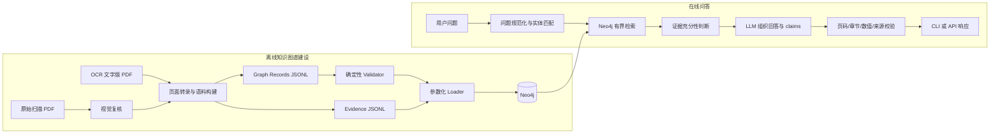
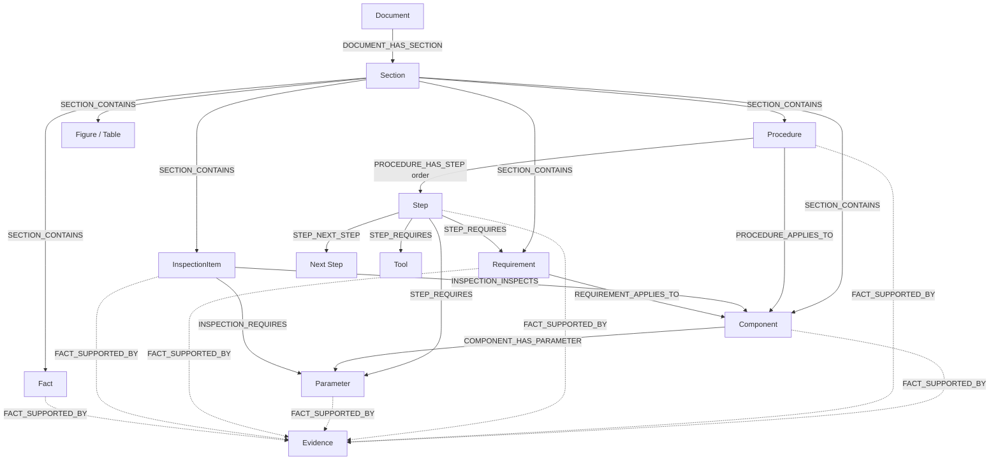

# 汽轮机知识图谱与 LangGraph 项目全流程技术交接文档


## 目录

1. [项目目标与边界](#1-项目目标与边界)
2. [技术栈与目录职责](#2-技术栈与目录职责)
3. [整体架构与两条主流程](#3-整体架构与两条主流程)
4. [知识图谱 Schema](#4-知识图谱-schema)
5. [Graph Record 与三元组如何形成](#5-graph-record-与三元组如何形成)
6. [Validator 与 Neo4j Loader](#6-validator-与-neo4j-loader)
7. [LangGraph 在线问答工作流](#7-langgraph-在线问答工作流)
8. [关键词、别名与实体定位算法](#8-关键词别名与实体定位算法)
9. [Neo4j 有界检索算法](#9-neo4j-有界检索算法)
10. [Evidence、证据充分性与回答校验](#10-evidence证据充分性与回答校验)
11. [端到端示例：盘车装置齿侧间隙](#11-端到端示例盘车装置齿侧间隙)
12. [CLI、API、配置与启动](#12-cliapi配置与启动)
13. [重建、校验、测试与维护](#13-重建校验测试与维护)
14. [当前实现边界与代码事实](#14-当前实现边界与代码事实)
15. [技术交接检查清单](#15-技术交接检查清单)

---

## 1. 项目目标与边界

本项目把《汽轮机本体安装及维护说明书》建设为可追溯的 Neo4j 知识图谱，并通过 LangGraph 编排“问题解析—图谱检索—证据判断—LLM 组织回答—引用校验”流程，为汽轮机安装、调试、检查和维护问题提供基于原始资料的回答。

项目的核心要求不是“让大模型知道汽轮机知识”，而是保证每条说明书结论都可以沿以下链路回到原文：

```text
回答中的 claim
→ 本次检索得到的 Evidence ID
→ PDF 物理页 + 章节
→ 经复核的原文片段
```

### 1.1 唯一正式知识源

当前正式知识源只有：

```text
Original materials/汽轮机本体安装及维护说明书.pdf
```

其他资料的角色如下：

| 资料 | 当前用途 | 是否进入运行时答案 |
|---|---|---|
| `汽轮机本体安装及维护说明书.pdf` | 唯一正式来源、物理页和图像复核基准 | 是，通过 Neo4j Evidence 间接进入 |
| `汽轮机本体安装及维护说明书_文字版.pdf` | OCR 辅助转录、语料构建 | 不作为独立知识源 |
| `260814 安调处置方案.docx` | 检查四个盲测问题标记是否存在、离线验收参考 | 否，答案不写入图谱和提示词 |
| `evaluation/*.json` | 离线测试与回归 | 否 |

运行时的 LangGraph 和 LLM **不读取 PDF、OCR PDF、Word 或离线标准答案**，只读取本次 Neo4j 查询返回的 Evidence。

### 1.2 当前规模

根据当前 `neo4j/data` 文件实算：

| 项目 | 数量 | 说明 |
|---|---:|---|
| 原始 PDF 物理页 | 94 | 全部登记页级 Evidence |
| Graph Records | 1022 | 每条对应一条业务关系及其 Evidence |
| 业务 Entity | 1121 | 不含 Evidence 节点 |
| Evidence | 909 | 来自 `evidence.jsonl` |
| Graph Record 内唯一 Evidence | 815 | 其余 Evidence 主要是独立页级定位证据 |
| Graph Record 业务关系 | 1022 | 13 种关系当前有实例 |
| Neo4j 总关系 | 3246 | 项目总览记录值，包含 Loader 生成的追溯关系 |

Schema 定义了 15 种节点标签：14 种业务 `Entity` 类型和独立的 `Evidence`；定义了 15 种关系，其中 14 种是业务关系，`FACT_SUPPORTED_BY` 是追溯关系。

### 1.3 明确边界

- 当前只支持一份说明书，没有多文档隔离、版本优先级和冲突消解。
- 当前不支持仅按“第 61 页”之类的页码查询，问题应包含部件、工序、参数或章节主题。
- 图谱证据不足时，不使用通用工程知识补写结论。
- 涉及打磨、扩孔、吊装、承载、间隙调整等不可逆或高风险操作时，系统输出不能替代现场测量、制造厂图纸、审批和复验。
- 运行时是只读检索；写库只由 Validator 和 Loader 控制。

---

## 2. 技术栈与目录职责

### 2.1 技术栈

| 层次 | 技术 | 作用 |
|---|---|---|
| 知识存储 | Neo4j | 保存实体、业务关系、Evidence 和追溯边 |
| 工作流 | LangGraph | 串联五个问答节点并维护共享 State |
| 大模型接口 | `langchain-openai` / `ChatOpenAI` | 兼容 OpenAI 风格 API，负责抽取或组织回答 |
| API | FastAPI + Pydantic | 提供 `POST /recommend` |
| CLI | Python `argparse` | 本地交互、输出检索轨迹和证据位置 |
| 数据格式 | JSONL / YAML / JSON | Graph Records、Evidence、本体和别名 |
| 部署 | Docker Compose | 启动 Neo4j 容器并挂载持久化目录 |
| 测试 | pytest | 验证问题解析、检索边界、证据评估和回答校验 |

### 2.2 目录职责

```text
demo/
├─ PROJECT_OVERVIEW.md             项目状态与总体说明
├─ README.md                       启动、更新和注意事项
├─ PROJECT_WORKFLOW.md             本文：全流程技术交接
├─ neo4j/
│  ├─ ontology/                    冻结本体、Schema、抽取提示词
│  ├─ data/                        正式 Graph Records、Evidence、别名、缺口
│  ├─ validator/                   确定性 Graph Record 校验
│  ├─ loader/                      语料构建、可选抽取、Neo4j 入库
│  ├─ cypher/                      约束、索引、质量检查、架构查看
│  └─ docker-compose.yml           Neo4j 容器配置
├─ langgraph_app/
│  ├─ src/graph.py                 LangGraph 组装与 invoke 入口
│  ├─ src/state.py                 工作流共享状态
│  ├─ src/nodes/                   五个工作流节点
│  ├─ src/tools/                   关键词目录与 Neo4j 检索工具
│  ├─ src/api.py                   FastAPI 接口
│  ├─ src/cli.py                   CLI 入口
│  ├─ prompts/                     生成规则说明
│  └─ tests/                       自动化测试
├─ docs/                           结构、纠错、抽取和质量报告
└─ evaluation/                     盲测与 PDF-first 回归数据
```

关键实现入口：

- 离线语料构建：`neo4j/loader/build_corpus.py`
- 可选 LLM 抽取：`neo4j/loader/extract_graph_records.py`
- 数据校验：`neo4j/validator/validator.py`
- Neo4j 写入：`neo4j/loader/load_graph.py`
- 在线工作流：`langgraph_app/src/graph.py`
- 关键词定位：`langgraph_app/src/tools/keyword_catalog.py`
- Neo4j 检索：`langgraph_app/src/tools/neo4j_tool.py`

---

## 3. 整体架构与两条主流程

项目分成互相隔离的“离线建图”和“在线问答”两条链路。

### 3.1 总体架构



### 3.2 离线建图流程

```text
扫描 PDF + OCR 辅助文本
→ 94 页页面清单和页级 Evidence
→ 人工整理的语义记录、补充记录、原文分句 Fact
→ 实体属性规范化
→ graph_records.jsonl + evidence.jsonl + ontology_gaps.jsonl
→ Validator 白名单校验
→ Loader 过滤 accepted 记录
→ MERGE 节点、业务边、Evidence、FACT_SUPPORTED_BY
→ Neo4j
```

重要原则：Neo4j 不负责读 PDF，也不负责自由抽取三元组；LLM 不生成写库 Cypher。

### 3.3 在线问答流程

```text
用户问题
→ normalize_question：分类、数值观察、领域短语、实体候选
→ neo4j_retrieval：精确根实体、有界邻接关系、Evidence 兜底
→ assess_evidence：筛选语义 Evidence，判断是否足够
→ generate_recommendation：只用当前 Evidence 调用 LLM
→ validate_response：重新绑定 claim，校验引用和数值
→ CLI/API
```

在线流程不修改 Neo4j，也不读取 `evaluation` 中的预期答案。

---

## 4. 知识图谱 Schema

Schema 的来源文件是 `neo4j/ontology/ontology.yaml`；Python Validator 在 `validator.py` 中维护同一套白名单。Schema 状态为 `frozen`，未知概念必须进入 ontology gap，不能由抽取模型临时创造新类型。

### 4.1 节点标签与当前数量

所有业务节点在 Neo4j 中同时带有基础标签 `Entity` 和具体类型标签，例如：

```cypher
(:Entity:Component {id: "TURBINE.COMPONENT.TURNING_GEAR", ...})
```

Evidence 是独立节点：

```cypher
(:Evidence {id: "EV_P061_TURNING_SIDE_CLEARANCE", ...})
```

| 节点类型 | 当前数量 | 必填属性 | 典型 ID | 用途 |
|---|---:|---|---|---|
| `Document` | 1 | `name`, `page_count` | `TURBINE_MANUAL` | 文档根节点、来源哈希和页数 |
| `Section` | 174 | `name` | `TURBINE.SECTION.2_17` | 章节、附录或页内容语义边界 |
| `Component` | 31 | `name` | `TURBINE.COMPONENT.TURNING_GEAR` | 汽缸、轴承、阀门、管道等物理对象 |
| `Procedure` | 28 | `name` | `TURBINE.PROCEDURE.TURNING_GEAR_INSTALLATION` | 安装、找中、焊接、吹管等程序 |
| `Step` | 38 | `name` | `TURBINE.STEP.TURNING_SIDE_CLEARANCE_CHECK` | 可排序的程序步骤 |
| `Tool` | 1 | `name` | `TURBINE.TOOL...` | 起吊、测量或专用工具 |
| `Parameter` | 59 | `name` | `TURBINE.PARAMETER...` | 数值、范围、单位、原始值 |
| `Requirement` | 87 | `name` | `TURBINE.REQUIREMENT...` | 工艺要求、限制和规范性陈述 |
| `Fact` | 666 | `name`, `statement` | `TURBINE.FACT.P061.008` | 从已复核页面拆出的细粒度原文事实 |
| `InspectionItem` | 15 | `name` | `TURBINE.INSPECTION...` | 检查对象、方式和验收条件 |
| `MaintenanceAction` | 3 | `name` | `TURBINE.MAINTENANCE...` | 维护、修复或保养动作 |
| `Risk` | 3 | `name` | `TURBINE.RISK...` | 风险、严重度和缓解措施 |
| `Figure` | 13 | `number` | `TURBINE.FIGURE.2_7_3` | 图号、图题和图类型 |
| `Table` | 2 | `number` | `TURBINE.TABLE.2_17_1` | 表号和表题 |
| `Evidence` | 909 | `document`, `pdf_page`, `source_text` | `EV_P061_TURNING_SIDE_CLEARANCE` | 原文、物理页、章节、区域和状态 |

业务实体合计 1121；Evidence 另计 909。

### 4.2 节点可选属性

| 类型 | 主要可选属性 |
|---|---|
| `Document` | `source_path`, `sha256`, `validation_status` |
| `Section` | `number`, `logical_order`, `description`, `validation_status` |
| `Component` | `aliases`, `description`, `system`, `status`, `validation_status` |
| `Procedure` | `procedure_type`, `description`, `status`, `validation_status` |
| `Step` | `order`, `action`, `preconditions`, `description`, `validation_status` |
| `Tool` | `tool_type`, `capacity`, `dimensions`, `description`, `validation_status` |
| `Parameter` | `aliases`, `value`, `unit`, `min_value`, `max_value`, `original_value`, `description`, `validation_status` |
| `Requirement` | `aliases`, `requirement_type`, `statement`, `validation_status` |
| `Fact` | `fact_type`, `validation_status` |
| `InspectionItem` | `aliases`, `inspection_type`, `acceptance_criteria`, `validation_status` |
| `MaintenanceAction` | `action_type`, `description`, `safety_note`, `validation_status` |
| `Risk` | `severity`, `description`, `mitigation`, `validation_status` |
| `Figure` | `caption`, `figure_type`, `validation_status` |
| `Table` | `caption`, `validation_status` |
| `Evidence` | `section`, `bbox`, `confidence`, `status`, `validation_status` |

稳定 ID 必须匹配 `^[A-Z][A-Z0-9_.-]+$`。实体 ID 通常使用 `TURBINE.<TYPE>.<NAME>` 命名空间，避免只按中文名称去重。

### 4.3 关系白名单、端点和当前数量

| 关系 | 合法方向 | 当前业务记录数 | 主要关系属性 | 语义 |
|---|---|---:|---|---|
| `DOCUMENT_HAS_SECTION` | `Document → Section` | 2 | `record_id`, `logical_order`, `evidence_ids`, `validation_status` | 文档包含章节 |
| `SECTION_CONTAINS` | `Section → Section/Component/Procedure/Requirement/InspectionItem/Fact/Figure/Table` | 784 | `record_id`, `logical_order`, `evidence_ids`, `validation_status` | 章节包含业务概念或原文 Fact |
| `COMPONENT_PART_OF` | `Component → Component` | 0 | `record_id`, `location`, `evidence_ids`, `validation_status` | 部件层级 |
| `PROCEDURE_APPLIES_TO` | `Procedure → Component` | 56 | `record_id`, `evidence_ids`, `validation_status` | 程序适用于部件 |
| `PROCEDURE_HAS_STEP` | `Procedure → Step` | 39 | `record_id`, `order`, `evidence_ids`, `validation_status` | 程序拥有有序步骤 |
| `STEP_NEXT_STEP` | `Step → Step` | 22 | `record_id`, `evidence_ids`, `validation_status` | 显式步骤顺序 |
| `STEP_REQUIRES` | `Step → Requirement/Tool/Parameter` | 38 | `record_id`, `condition`, `evidence_ids`, `validation_status` | 步骤的要求、工具或参数 |
| `COMPONENT_HAS_PARAMETER` | `Component → Parameter` | 29 | `record_id`, `parameter_role`, `evidence_ids`, `validation_status` | 部件参数 |
| `REQUIREMENT_APPLIES_TO` | `Requirement → Component/Procedure/InspectionItem` | 24 | `record_id`, `evidence_ids`, `validation_status` | 要求的适用对象 |
| `INSPECTION_INSPECTS` | `InspectionItem → Component/Procedure` | 16 | `record_id`, `evidence_ids`, `validation_status` | 检查什么 |
| `INSPECTION_REQUIRES` | `InspectionItem → Parameter/Requirement` | 1 | `record_id`, `evidence_ids`, `validation_status` | 检查标准或参数 |
| `MAINTENANCE_APPLIES_TO` | `MaintenanceAction → Component` | 3 | `record_id`, `evidence_ids`, `validation_status` | 维护动作适用于部件 |
| `MAINTENANCE_ADDRESSES` | `MaintenanceAction → Risk/Requirement` | 3 | `record_id`, `evidence_ids`, `validation_status` | 维护动作处理风险或要求 |
| `PROCEDURE_REFERENCES` | `Procedure/Section → Figure/Table` | 5 | `record_id`, `reference_text`, `evidence_ids`, `validation_status` | 程序或章节引用图表 |
| `FACT_SUPPORTED_BY` | 业务节点 `→ Evidence` | Loader 生成 | `fact_id`, `confidence`, `validation_status` | 把业务事实追溯到证据 |

当前 `graph_records.jsonl` 使用 13 种业务关系；`COMPONENT_PART_OF` 已定义但当前没有记录。`FACT_SUPPORTED_BY` 不作为正式 Graph Record 输入，而是在加载时根据每条 Graph Record 自动生成。

### 4.4 核心结构图



### 4.5 `Entity` 和 `Evidence` 的职责差异

- `Entity` 表示可查询、可复用、可关联的业务概念。
- `Evidence` 表示来源，不应被当作领域推理对象。
- 数值通常进入 `Parameter` 属性或 Evidence 原文，不应把“0.3～0.6mm”单独建成无上下文节点。
- “第一步、第二步”由 `order` 和 `STEP_NEXT_STEP` 表达，不建成新的类型。
- Evidence 的 `pdf_page` 是物理页，是当前唯一统一定位方式。

---

## 5. Graph Record 与三元组如何形成

### 5.1 Graph Record 不是裸三元组

传统三元组只有：

```text
source -[relationship]-> target
```

本项目使用带实体属性、关系属性和证据的 Graph Record：

```json
{
  "record_id": "REC_...",
  "source": {"type": "...", "id": "...", "properties": {}},
  "relationship": {"type": "...", "properties": {}},
  "target": {"type": "...", "id": "...", "properties": {}},
  "evidence": [
    {
      "evidence_id": "EV_...",
      "document": "汽轮机本体安装及维护说明书.pdf",
      "pdf_page": 1,
      "section": "...",
      "source_text": "...",
      "status": "accepted"
    }
  ]
}
```

`relationship.properties.record_id` 必须等于顶层 `record_id`；`relationship.properties.evidence_ids` 必须与内嵌 Evidence 顺序和内容完全一致。

### 5.2 真实结构示例：盘车齿侧间隙

以下示例保留真实 ID 和语义，但省略与说明无关的属性：

```json
{
  "record_id": "REC_TURNING_STEP_SIDE_CLEARANCE",
  "source": {
    "type": "Procedure",
    "id": "TURBINE.PROCEDURE.TURNING_GEAR_INSTALLATION",
    "properties": {"name": "盘车装置安装与试验", "validation_status": "accepted"}
  },
  "relationship": {
    "type": "PROCEDURE_HAS_STEP",
    "properties": {
      "record_id": "REC_TURNING_STEP_SIDE_CLEARANCE",
      "order": 7,
      "evidence_ids": ["EV_P061_TURNING_SIDE_CLEARANCE"],
      "validation_status": "accepted"
    }
  },
  "target": {
    "type": "Step",
    "id": "TURBINE.STEP.TURNING_SIDE_CLEARANCE_CHECK",
    "properties": {
      "name": "检查盘车装置齿侧间隙",
      "order": 7,
      "action": "独立检查盘车装置齿侧间隙，要求为0.3～0.6mm。",
      "validation_status": "accepted"
    }
  },
  "evidence": [{
    "evidence_id": "EV_P061_TURNING_SIDE_CLEARANCE",
    "document": "汽轮机本体安装及维护说明书.pdf",
    "pdf_page": 61,
    "section": "2-17",
    "source_text": "检查盘车装置齿侧间隙，要求为0.3～0.6mm。",
    "status": "accepted"
  }]
}
```

### 5.3 正式语料的实际构建方式

正式 `graph_records.jsonl` 由 `build_corpus.py` 写出。主流程是：

1. 检查正式 PDF、OCR PDF 和 Word 文件存在。
2. 读取 Word，只验证四个盲测主题标记存在；不复制 Word 答案。
3. 校验两个 PDF 都是 94 页且页数一致。
4. 计算正式 PDF 的 SHA-256。
5. `build_page_manifest()` 为每个物理页建立 `EV_PAGE_###` Evidence，文本来自 OCR PDF，页面状态写为 `accepted`。
6. `build_curated_records()` 生成代码中人工整理的核心语义实体和关系。
7. `build_supplemental_records()` 和 `build_additional_page_records()` 补充已复核的细节事实。
8. `build_source_clause_records()` 把实质性页面转录拆为原文 Fact。
9. `canonicalize_records()` 统一同一稳定 ID 在不同记录中的属性：普通属性选出现频率最高的值，`aliases` 做并集。
10. 写出 `evidence.jsonl`、`graph_records.jsonl`、`ontology_gaps.jsonl` 和别名文件。

因此，当前正式图谱不是一次“大模型自动抽完整 PDF”的结果，而是：

```text
人工整理的核心语义记录
+ 经复核的补充记录
+ 从页面转录确定性拆分的原文 Fact
```

### 5.4 原文 Fact 的生成

`_split_reviewed_source_clauses()` 对页面转录进行保守拆分：

- 删除固定页眉、签审栏和页尾编号噪声；
- 在句号、问号、分号、表格行标记和字母分项处分割；
- 丢弃中文字符少于 5 或总长度小于 8 的片段；
- 丢弃已知 OCR 噪声；
- 不改写原文，只做裁剪和拆分。

每个片段形成：

```text
Section(PAGE_CONTENT_###)
  -[SECTION_CONTAINS]->
Fact(P###.###)
  ↘ Evidence(EV_CLAUSE_P###_###)
```

这些 Fact 扩展了长尾检索覆盖，但在关键词实体排序中会被降权，避免长 OCR 句子挤掉精确的 Parameter、InspectionItem 或 Procedure。

### 5.5 可选的 LLM 抽取通道

`extract_graph_records.py` 提供另一条可选通道：

```text
已复核页面块 JSONL
→ 注入 extraction_prompt.md + ontology.yaml
→ ChatOpenAI 输出 records 和 ontology_gaps
→ 把 Evidence 强制回绑到输入页面块
→ validate_record(require_accepted=True)
→ graph_records.llm.jsonl / ontology_gaps.llm.jsonl
```

关键门禁：

- 输入块必须包含 `evidence_id`、`document`、`pdf_page`、`source_text`。
- 模型返回的 `source_text` 必须是输入块文本中的连续子串。
- 模型不能把非 `accepted` 输入提升为 `accepted`。
- 模型输出必须是 JSON 对象，不能直接生成 Cypher。
- 未知实体类型、关系、属性、非法方向、错误 ID 或错误 Evidence 会被 Validator 拒绝。
- 异常记录转为 `ontology_gaps`，不会静默写库。

**实现事实：**该脚本默认写 `graph_records.llm.jsonl`，当前没有代码自动把它合并到正式 `graph_records.jsonl`。必须经过人工审核、合并、再次校验后才能由 Loader 使用。

### 5.6 Ontology gap

冻结 Schema 无法表达的新概念应写入 `ontology_gaps.jsonl`，至少说明：

- 来源页和章节；
- 无法表达的概念；
- 当前 Schema 的缺口原因；
- 建议类型或关系；
- 风险和审核状态。

只有经过本体审核，才可以升级 Schema；普通抽取不允许自行扩展类型。

---

## 6. Validator 与 Neo4j Loader

### 6.1 Validator 校验内容

`validator.py` 不依赖 LLM，按固定白名单逐条校验：

1. 顶层只能有 `record_id/source/relationship/target/evidence`。
2. `record_id`、实体 ID 和 Evidence ID 必须符合稳定 ID 格式。
3. 禁止 `REF.*` 外部实体。
4. 节点类型必须在 Schema 白名单中。
5. 每类节点必须包含必填属性，且不能出现未知属性。
6. 关系类型和关系属性必须在白名单中。
7. `source type → relationship → target type` 必须是合法端点。
8. Evidence 必须来自唯一说明书，物理页必须在 1–94。
9. Evidence 必须有非空章节和原文。
10. `confidence` 必须在 0–1，`bbox` 必须是四个数字。
11. `validation_status/status` 必须属于 `accepted/pending/rejected/source_only`。
12. `relationship.evidence_ids` 必须与内嵌 Evidence 完全一致。

`--accepted-only` 会只对 Evidence 全部为 `accepted` 的记录执行可加载校验；Loader 还会对每条记录再次执行 `require_accepted=True`。

### 6.2 Loader 写入模型

Loader 使用参数化 Cypher 和白名单类型拼接：

```text
节点：MERGE (:Entity:<Type> {id})
业务边：MERGE (source)-[:<Relation> {record_id}]->(target)
Evidence：MERGE (:Evidence {id})
追溯边：MERGE (entity)-[:FACT_SUPPORTED_BY {fact_id}]->(evidence)
```

业务边以 `record_id` 作为关系键。相同端点和相同关系类型可以存在多条独立事实，避免后加载记录覆盖先前事实的出处。

Loader 为每条 Graph Record 的 source 和 target 都建立 `FACT_SUPPORTED_BY`，并以同一 `fact_id` 绑定 Evidence。运行时查询又要求：

```text
support.fact_id = business_relation.record_id
AND evidence.id IN business_relation.evidence_ids
```

这样可以避免“节点和 Evidence 有连接”被误当作“当前这条业务关系由该 Evidence 支持”。

### 6.3 约束和索引

Loader 或 `constraints.cypher` 创建：

```cypher
CREATE CONSTRAINT entity_id_unique ... REQUIRE n.id IS UNIQUE;
CREATE CONSTRAINT evidence_id_unique ... REQUIRE n.id IS UNIQUE;
CREATE FULLTEXT INDEX entity_text ... ON EACH [n.name, n.aliases, n.description];
CREATE FULLTEXT INDEX evidence_text ... ON EACH [e.source_text, e.section];
```

这些约束保证 ID 唯一，并为未来或人工查询提供全文索引。

**实现事实：**当前 `Neo4jEvidenceTool.query()` 没有调用 `db.index.fulltext.queryNodes`，在线检索主要使用参数化 `MATCH`、字符串等值/`CONTAINS` 和 Python 排序。索引已经创建，但不是当前自动检索的主要执行路径。

### 6.4 普通重载与 `--reset` 的风险

不带 `--reset` 时，Loader 会：

- 删除非本说明书的 Evidence；
- 删除本说明书中已不在当前白名单里的 Evidence；
- 删除 `REF.*` 实体；
- 删除不在当前语料中的 `TURBINE.*` 实体；
- 重建关系；
- 重新写入 Evidence、业务节点、业务边和追溯边。

**重要实现观察：**当前关系清理 Cypher 是：

```cypher
MATCH ()-[r]->() DELETE r
```

它会删除配置数据库中的**全部关系**，并未限定 `TURBINE.*` 范围。因此当前 Neo4j 数据库必须视为项目专用数据库，不要与其他业务图谱共用同一个 database。

`--reset` 执行：

```cypher
MATCH (n) DETACH DELETE n
```

会清空配置数据库中的全部节点和关系。除非明确需要从零重建专用数据库，否则不要使用。

---

## 7. LangGraph 在线问答工作流

### 7.1 固定五节点流程

`langgraph_app/src/graph.py` 建立的是固定线性图：


当前没有 conditional edge。证据充分或不足不会改变节点路径，而是通过 State 字段控制后续节点输出。

### 7.2 State 主要字段

| 字段 | 产生节点 | 含义 |
|---|---|---|
| `request_id` | 入口 | CLI/API 请求标识 |
| `question` | 入口 | 原始问题 |
| `case_types` | 问题规范化 | 一般问题、损伤、修配、尺寸异常、验收时机等 |
| `observations` | 问题规范化 | 用户输入中的数值、单位、异常现象 |
| `query_terms` | 问题规范化 | 提交给检索工具的规范词、别名和领域短语 |
| `focus_terms` | 问题规范化 | 用于目标相关性判断的关键词 |
| `matched_entities` | 问题规范化 | 候选实体 ID、类型、得分和命中词 |
| `retrieval_plan` | 问题规范化 | 计划中的查询阶段名称 |
| `kg_evidence` | Neo4j 检索/评估 | 当前查询返回并筛选后的 Evidence 行 |
| `evidence_sufficient` | 检索/评估 | 是否存在足够的语义证据 |
| `missing_information` | 多节点 | 缺失事实和人工复核要求 |
| `input_warnings` | 多节点 | 单位、占位符、服务异常、校验失败等警告 |
| `retrieval_trace` | 检索 | 词项、根实体数、查询阶段、流程根 ID、结果数 |
| `answer` | 回答生成/校验 | 最终文本 |
| `claims` | 回答生成 | 结构化说明书结论或用户输入陈述 |
| `citations` | 回答校验 | 统一的物理页、章节和 Evidence ID |

### 7.3 五个节点的职责

#### 节点 1：`normalize_question`

- 检测损伤、现场修配、尺寸配合异常和验收时机等问题类型。
- 抽取用户输入中的数值和单位，不静默把 `m` 改为 `mm`。
- 生成领域短语和候选实体。
- 对 `xxx` 占位符、`m` 单位或未命中别名生成警告。

#### 节点 2：`neo4j_retrieval`

- 调用只读 `Neo4jEvidenceTool`。
- 返回标准化 Evidence 行和检索轨迹。
- Neo4j 不可用时不抛出普通回答，而是记录“无法取得 PDF 图谱证据”。

#### 节点 3：`assess_evidence`

- 过滤非本说明书、缺页码、缺原文、缺 Evidence ID 的结果。
- 区分语义 Evidence 和页级定位文本。
- 针对聚焦、清单、流程、测量和高风险问题重新限定证据边界。
- 去重同一个 Evidence 的多条关系行。
- 最终设置 `evidence_sufficient` 和 `missing_information`。

#### 节点 4：`generate_recommendation`

- 把当前问题、Evidence、警告和缺失信息组成提示词。
- 按“主站 → 备用站 1 → 备用站 2”调用兼容 API，每个站点不在内部重试。
- 要求 LLM 只输出 JSON：`answerable/missing_information/answer/claims`。
- 忽略模型提供的 Evidence ID，系统稍后按本次检索页码重新绑定。
- 若确定性评估认为证据不足，则强制返回证据不足说明。

**实现观察：**当前代码先调用 LLM，再检查 `state.evidence_sufficient`。也就是说，证据不足的请求仍可能发生一次 LLM 调用，但最终会被系统门禁转换为证据不足回答。

#### 节点 5：`validate_response`

- 统一说明书全名和引用格式。
- 校验 claim 的 grounding、Evidence ID、物理页、章节和数值。
- 检查回答引用的页码是否属于本次检索和对应 claim。
- 检查回答中的带单位数值是否存在于 Evidence 或 `user_input` claim。
- 生成结构化 `citations`。
- 校验失败时保留有用正文，但追加明确的“依据校验提示”和人工复核警告。

---

## 8. 关键词、别名与实体定位算法

### 8.1 关键词不是 LLM 生成的

当前关键词和实体路由由确定性 Python 代码完成：

```text
graph_records.jsonl + entity_aliases.json
→ load_keyword_catalog()
→ match_question()
→ normalize_question()
→ query_terms / focus_terms / matched_entities
```

LangGraph 只负责调用节点；LLM 不参与运行时关键词抽取。

### 8.2 关键词目录如何建立

`load_keyword_catalog()` 遍历所有 Graph Record 的 source 和 target，对每个稳定实体 ID 收集：

- `name`
- `caption`
- `number`
- 节点自身 `aliases`
- `entity_aliases.json` 中与 canonical 名称**精确对应**的人工别名

`description` 不进入关键词路由目录。Neo4j 索引包含 description，但当前自动检索没有调用全文索引，因此 description 不是当前根实体匹配的主要来源。

目录使用 `@lru_cache(maxsize=1)` 缓存在进程内。Graph Records 或别名更新后，应重启 CLI/API 进程，避免继续使用旧目录。

### 8.3 变体与内部 n-gram

`_variants()` 对名称和别名生成：

- 原字符串；
- 去空格字符串；
- 按顿号、斜杠、括号、逗号等拆出的片段；
- 中文连续串的 2–8 字滑动片段。

2–8 字片段只用于内部召回。例如“盘车齿轮间隙”可以通过字符重叠找到“盘车装置”或“盘车齿侧间隙”。代码会阻止派生碎片进入公开 trace，避免显示“车装置齿”这类不可读词。

停用词如“安装、检查、设备、过程、要求、参数、尺寸”不能单独识别实体。少量短领域根词如“盘车、吹管、灌浆、汽缸、轴承”允许作为直接路由词。

### 8.4 问句形状匹配

`_question_shape()` 去掉“有哪些、是什么、如何、是否、需要、的、了、吗”等问句胶水词，并删除连字符，用于长 canonical 的自然问法匹配。

例如：

```text
实体：使用MF-870G灌浆料的优点
问题：使用MF-870G灌浆料有哪些优点
```

两者去掉问句胶水后可以形成 shape match。该形状只用于选实体，不作为公开查询词。

### 8.5 实体打分

`match_question()` 的主要得分为：

```text
exact canonical 出现在问题中            +1000
长 canonical 与问题形状匹配              +700
最长直接名称/别名 >= 8 字                +1800
最长直接名称/别名 >= 4 字                 +700
存在更短直接命中                           +50
最长命中长度 × 20
```

`Fact` 节点还会：

- 按多个不重叠派生短语增加覆盖得分；
- 固定减 250 分，避免长原文 Fact 压过精确业务实体。

同分时按类型优先级排序：

```text
InspectionItem → Procedure → Component → Step → Requirement
→ Section → Figure → Table → Fact
```

当问题明确包含“参数”时，`Parameter` 优先级提升到第一；否则 Parameter 位于 Component 之后的相近层级。随后按 canonical 长度和字典序稳定排序。

`normalize_question()` 请求最多 24 个候选实体，为短专业词保留 Procedure、Parameter 和细粒度 Fact 的召回空间。

### 8.6 领域短语兜底

`_fallback_terms()` 不生成所有问句滑窗，而是组合三种来源：

1. 代码维护的汽轮机领域短语表；
2. 按标点和语法连接词切分出的 2–12 字对象/动作短语；
3. 英数字 token、中文连续 token，以及 `ψ`、`ΔL` 等符号。

兜底词最多 12 个；与目录发现词合并后的 `focus_terms` 最多 20 个。

### 8.7 三组检索词

| 词组 | 作用 |
|---|---|
| `root_terms` | 定位规范实体名称、编号或别名 |
| `target_terms` | 从问题中分离具体目标，如某项检查、参数或动作 |
| `focus_terms` | 排除泛词后用于证据相关性筛选；特定测量问题会进一步收缩 |

`query_terms` 是完整候选集合；公开 trace 只显示直接命中或确实出现在问题中的可读短语。

---

## 9. Neo4j 有界检索算法

### 9.1 查询工具的安全约束

`Neo4jEvidenceTool` 是只读、单文档、有界工具：

- Cypher 模板写死在代码中；
- 用户文本只作为参数传入；
- 只接受 `validation_status/status = accepted`；
- Evidence 必须属于唯一说明书；
- 返回数量受问题类型上限控制；
- 不允许 LLM 生成 Cypher。

### 9.2 根实体解析

根实体可以是：

```text
Component / Procedure / Section / Document / Figure / Table /
Parameter / Requirement / InspectionItem / Step / Tool / Fact
```

Cypher 按以下条件解析最多 20 个根实体：

- ID 在候选 `root_ids` 中；或
- `name/caption/number` 与 `root_terms` 精确相等；或
- 某个 alias 与 `root_terms` 精确相等。

候选 ID 的优先顺序来自关键词目录得分，叶子实体 Parameter/Requirement/InspectionItem/Step 在相同条件下优先。

### 9.3 有根实体时的业务关系查询

对已解析根实体查询直接相邻业务边，并同时验证关系证据：

```text
(source:Entity)-[rel]->(target:Entity)
(source)-[FACT_SUPPORTED_BY {fact_id = rel.record_id}]->(Evidence)
Evidence.id ∈ rel.evidence_ids
```

查询返回：

- 关系 `record_id/type`；
- source/target ID、名称和关键属性；
- Evidence ID、文档、物理页、章节、原文、置信度；
- 目标词在原文中的命中分数。

另有一个 `direct_root_query`，确保最高优先级叶子或结构根的直接事实不会因为邻居过多而在 Cypher limit 前被挤掉。

### 9.4 无根实体时的兜底

若没有解析出实体，兜底查询在所有已接受业务关系及其 Evidence 上检查：

- source/target 的名称、图题、编号、别名；
- Evidence 原文；
- Evidence 章节。

这仍是业务关系绑定查询，不是让 LLM 自由搜索数据库。

### 9.5 页级 Evidence 兜底

无论是否有根实体，工具还会执行页级 Evidence 文本定位，最多取 40 条候选。评分规则为：

```text
原文包含 term：len(term)²
章节包含 term：len(term)
```

处理方式：

- `EV_CLAUSE_*` 和非 `EV_PAGE_*` 的 `EV_P*` 可转成 `DIRECT_EVIDENCE_MATCH` 候选；
- `EV_PAGE_*` 只能成为 `PAGE_EVIDENCE_MATCH` 或同页补充；
- 已有直接语义 Evidence 后，不再让普通页级命中稀释结果；
- 流程问题已锁定 Procedure 后，禁止词法 Evidence 重新引入兄弟流程。

### 9.6 不同问题类型

#### 聚焦问题

示例：“盘车装置齿侧间隙是多少？”

- 保留部件/程序上下文和“齿侧间隙”目标。
- 识别唯一测量名词“间隙”，生成具体测量目标。
- 最终 Evidence 原文本身必须包含该测量对象或容许的对象省略形式。
- 默认最多保留 10 个唯一 Evidence。

#### 清单问题

示例：“盘车装置安装前要准备哪些内容？”

- “准备、哪些、有哪些、注意”等触发清单模式。
- 不用单个 focus term 截断同一 Procedure/Section 的并列事实。
- 保留结构根直接支持的 Evidence，允许跨物理页。
- 默认最多 20 个唯一 Evidence。

#### 多目标问题

示例：“基础需要湿润多久，施工温度是多少？”

- 两个以上叶子实体、多个测量词、“分别”或复合动作可触发多目标模式。
- 保留每个被请求叶子事实的直接 Evidence。
- 不把所有结果压缩到一个关键词重叠最高的页面。

#### 流程问题

触发词包括“工作流程、流程、工序、步骤、顺序、怎么做、如何进行”。

流程检索执行：

1. 从候选 Section/Procedure 中选一个 primary structural match。
2. 优先最长、真正出现在问题中的 canonical 或 alias。
3. 若种子是 Section，解析其拥有的 Procedure；若种子是 Procedure，解析其父 Section 和自身。
4. 只要存在拥有者 Procedure，就只把该 Procedure 作为完整、排他的语义边界。
5. `direct_root_query` 按关系 `order`、目标节点 `order`、物理页排序。
6. 最多保留 80 个唯一 Evidence，以免长流程被普通 20 条上限截断。

因此“低压缸就位工作流程”不会因为父 Section 中存在“高中压缸就位”而把兄弟工序混入答案。

### 9.7 Python 端排序

Cypher 返回后，Python 再按以下元组倒序排序：

```text
(phrase_score, exact_root_bonus, retrieval_score, direct_evidence_bonus)
```

其中：

- 每个非冗余 focus term 命中内容：`len(term)²`；
- term 精确命中 source/target 名称：额外 `500 + len(term)²`；
- 结果连接高优先级候选实体：增加根实体亲和度；
- `DIRECT_EVIDENCE_MATCH` 只作为末级微小加分。

目标相关性优先于根实体亲和度，防止一个宽泛部件邻居压过精确原文条款。

### 9.8 去重、截断和同页补充

- 同一个 `(fact_id, evidence_id)` 先去重。
- 同一 Evidence 多条关系只保留排序最高的一行。
- 聚焦问题上限 10，清单 20，流程最多 80。
- 多词聚焦问题若最佳覆盖至少 2 个有效词，只保留最佳覆盖行。
- 特定测量问题再次要求 Evidence 原文匹配测量目标。
- 对前 3 个语义页可加入 `EV_PAGE_*` 的 `PAGE_CONTEXT_SUPPLEMENT`。
- 同页补充只给 LLM 看并列上下文，不能使证据从“不足”变成“充分”。

### 9.9 检索轨迹

工具返回的 `retrieval_trace` 包括：

```json
{
  "neo4j_queried": true,
  "query_templates": ["entity_id_name_caption_number_lookup", "..."],
  "terms": ["..."],
  "root_terms": ["..."],
  "target_terms": ["..."],
  "root_entity_count": 1,
  "result_count": 1,
  "retrieval_intent": "focused_or_checklist",
  "procedure_root_ids": []
}
```

流程问题的 `retrieval_intent` 为 `procedure_flow`，并记录最终采用的 Procedure ID。

---

## 10. Evidence、证据充分性与回答校验

### 10.1 Evidence 类型

| 类型 | 例子 | 证明能力 |
|---|---|---|
| 细粒度人工语义 Evidence | `EV_P061_TURNING_SIDE_CLEARANCE` | 可直接支持对应工程事实 |
| 复核原文条款 | `EV_CLAUSE_P061_008` | 可作为细粒度原文事实；需通过相关性筛选 |
| 页级 Evidence | `EV_PAGE_061` | 只用于定位和上下文，不能单独证明结论 |
| 运行时直接原文匹配 | `DIRECT_EVIDENCE_MATCH` | 由 `EV_P*`/`EV_CLAUSE_*` 提升的语义候选 |
| 同页上下文补充 | `PAGE_CONTEXT_SUPPLEMENT` | 帮助覆盖同页并列项，不能改变充分性 |

注意：`PAGE_CONTEXT_SUPPLEMENT` 是运行时包装的 relation type，不是本体中的持久化业务关系。

### 10.2 什么是“语义 Evidence”

`assess_evidence()` 要求 Evidence：

- 来自唯一说明书；
- 有 Evidence ID、物理页和非空原文；
- 通过直接语义关系返回；
- 不是 `EV_PAGE_*`；
- 若关系是 `SECTION_CONTAINS`，通常要求 Evidence 为细粒度 `EV_P*` 或 `EV_CLAUSE_*`。

只有页级文字命中时，系统会提示“只有页级文字命中，没有与问题目标直接关联的语义事实”，并要求人工复核。

### 10.3 证据相关性重筛

对非清单聚焦问题，评估节点重新计算 Evidence 对核心词的覆盖：

- 普通目标可使用原文、实体名、邻居名和章节；
- 测量目标主要要求原文本身匹配；
- 多个叶子目标保留每个直接绑定行；
- 精确根实体高分页面可作为锚定页面，排除偶然出现相同宽泛词的页面。

最后按 Evidence ID 去重，减少 LLM 提示词中的重复原文和引用错误。

### 10.4 高风险问题的额外门禁

问题会被识别为：

- `component_damage`
- `field_modification`
- `dimension_or_fit_mismatch`
- `inspection_timing_clarification`
- `general_maintenance`

尺寸异常和现场修配问题必须存在：

- `COMPONENT_HAS_PARAMETER`、`STEP_REQUIRES` 或 `INSPECTION_REQUIRES`；或
- 细粒度原文明确包含数值、型号或“必须、不得、应、取出、拆除、保持”等动作约束。

验收时机问题必须存在明确检查项、要求、参数、步骤或细粒度原文。高风险问题的核心目标若没有直接出现在语义 Evidence 中，`evidence_sufficient` 会被置为 `false`。

### 10.5 LLM 能看到什么

LLM 提示词包含：

- 原始用户问题；
- 当前日期；
- 本次检索 Evidence 的 source、relation、target；
- Evidence ID、物理页、章节和原文；
- 输入警告、缺失信息、证据充分性；
- 只输出 JSON、不得使用图谱外知识的严格规则。

LLM 看不到：

- PDF 全文；
- Word 处置方案答案；
- 离线 expected answers；
- 未被本次检索选中的 Neo4j 事实；
- `.env` 配置。

### 10.6 Claim 绑定

模型输出的 claim 形状为：

```json
{
  "text": "...",
  "grounding": "knowledge_graph",
  "pdf_pages": [61],
  "section": "2-17"
}
```

模型不负责提供可信 Evidence ID。系统会：

1. 丢弃模型提供的 `evidence_ids`；
2. 按 claim 的 `pdf_pages` 从本次检索结果重新取 Evidence；
3. 排除 `EV_PAGE_*`、页级匹配和同页补充；
4. 写入真实 `evidence_ids`；
5. 根据语料中的规范章节修正 section。

`user_input` claim 不绑定 Evidence，用于原样复述现场数值或现象，不能冒充说明书结论。

### 10.7 回答依据校验

`validate_response()` 校验：

- claims 必须存在且结构有效；
- grounding 只能是 `knowledge_graph` 或 `user_input`；
- knowledge graph claim 的 Evidence ID 必须来自本次检索；
- claim 物理页必须与 Evidence 完全一致；
- claim 章节必须与 Evidence/语料规范章节一致；
- claim 和回答里的带单位数值必须出现在绑定原文或用户输入 claim 中；
- 回答中的物理页必须属于本次检索和 claim；
- 不能出现旧版页码字段；
- 证据不足回答必须明确“证据不足、无法、不能或人工复核”。

模型遗漏标准引用但 claims 合法时，系统自动追加规范位置；旧式回答缺 claims 时，代码尝试建立一个 legacy claim。

校验失败后不会隐藏正文，而是：

```text
保留回答正文
+ 依据校验提示：具体失败原因
+ 检索位置
+ input_warnings 中的人工复核警告
```

### 10.8 失败模式

| 场景 | 系统行为 |
|---|---|
| Neo4j 不可用 | `kg_evidence=[]`，标记证据不足，说明无法取得 PDF 图谱证据 |
| 只有页级命中 | 不视为语义充分，要求人工复核原文 |
| 高风险目标未覆盖 | 证据不足，不给出图谱外处置结论 |
| LLM 返回空回答 | 转为确定性证据不足回答 |
| LLM 单站失败 | 按配置切换下一个站点 |
| 全部 LLM 站点失败 | CLI 非零退出；API 返回 503 |
| 其他 LLM 生成异常 | 返回服务不可用说明和已取得的证据位置，不调用其他资料补结论 |
| Claim/页码/数值校验失败 | 保留正文并显著提示校验失败、要求人工复核 |

---

## 11. 端到端示例：盘车装置齿侧间隙

问题：

```text
盘车装置齿侧间隙如何检查？
```

### 11.1 问题规范化

`_fallback_terms()` 可提取：

```text
盘车装置、齿侧间隙、盘车、间隙
```

关键词目录可以命中：

```text
Component: TURBINE.COMPONENT.TURNING_GEAR（盘车装置）
Step: TURBINE.STEP.TURNING_SIDE_CLEARANCE_CHECK（检查盘车装置齿侧间隙）
Procedure: TURBINE.PROCEDURE.TURNING_GEAR_INSTALLATION（盘车装置安装与试验）
```

问题只含一个测量名词“间隙”，`select_specific_measurement_terms()` 会把目标收缩到“齿侧间隙”，避免法兰面间隙、装配间隙等同部件邻居混入。

### 11.2 精确根实体和业务关系

高分叶子实体是：

```text
TURBINE.STEP.TURNING_SIDE_CLEARANCE_CHECK
```

直接关系是：

```text
TURBINE.PROCEDURE.TURNING_GEAR_INSTALLATION
  -[PROCEDURE_HAS_STEP {order: 7,
                        record_id: REC_TURNING_STEP_SIDE_CLEARANCE}]->
TURBINE.STEP.TURNING_SIDE_CLEARANCE_CHECK
```

### 11.3 Evidence 绑定

该业务关系的 `evidence_ids` 包含：

```text
EV_P061_TURNING_SIDE_CLEARANCE
```

Loader 创建追溯边：

```text
Procedure -[FACT_SUPPORTED_BY {fact_id: REC_TURNING_STEP_SIDE_CLEARANCE}]-> Evidence
Step      -[FACT_SUPPORTED_BY {fact_id: REC_TURNING_STEP_SIDE_CLEARANCE}]-> Evidence
```

Evidence 内容：

```text
文档：《汽轮机本体安装及维护说明书》
物理页：61
章节：2-17
原文：检查盘车装置齿侧间隙，要求为0.3～0.6mm。
```

### 11.4 排序和评估

- “齿侧间隙”同时命中 Step 名称和 Evidence 原文，得到高 phrase score。
- Step 是高分叶子根，得到根实体亲和度。
- 特定测量过滤要求原文包含“齿侧间隙”，因此“检查法兰面间隙，0.05mm 塞尺不入”等邻居会被排除。
- Evidence 不是 `EV_PAGE_*`，关系属于直接语义关系，因此可作为充分证据。

### 11.5 LLM 和最终校验

LLM 只收到这次筛选后的证据，并输出 answer 和物理页 61 的 claim。系统随后：

1. 按物理页 61 重新绑定 `EV_P061_TURNING_SIDE_CLEARANCE`；
2. 把章节规范为 `2-17`；
3. 检查 `0.3～0.6mm` 是否存在于 Evidence 原文；
4. 检查回答引用页是否属于本次检索；
5. 生成 citation：

```text
《汽轮机本体安装及维护说明书》物理页61，章节2-17
```

该示例体现了完整链路：

```text
问题短语
→ Step/Procedure 实体
→ PROCEDURE_HAS_STEP
→ EV_P061_TURNING_SIDE_CLEARANCE
→ LLM claim
→ 页码、章节、数值校验
```

---

## 12. CLI、API、配置与启动

### 12.1 环境准备

在 Windows CMD 中：

```cmd
cd /d "D:\本体\汽轮机安调项目\项目初期demo\demo"
conda activate turbine-kg-env
```

确认但不要公开以下文件：

- `neo4j/.env`：Neo4j URI、用户名、密码、数据库名；
- `langgraph_app/.env`：Neo4j 和 LLM 主备站点配置。

相关环境变量名称：

```text
NEO4J_URI
NEO4J_USERNAME
NEO4J_PASSWORD
NEO4J_DATABASE
LLM_BASE_URL
LLM_MODEL
OPENAI_API_KEY
LLM_FALLBACK_BASE_URL
LLM_FALLBACK_MODEL
LLM_FALLBACK_API_KEY
LLM_FALLBACK_2_BASE_URL
LLM_FALLBACK_2_MODEL
LLM_FALLBACK_2_API_KEY
LLM_TIMEOUT_SECONDS
```

不要把变量的真实值写进文档或提交到仓库。

### 12.2 启动 Neo4j

已有容器：

```cmd
docker start turbine-kg-neo4j
```

首次创建：

```cmd
docker compose --env-file neo4j\.env -f neo4j\docker-compose.yml up -d neo4j
```

检查：

```cmd
docker ps --filter "name=turbine-kg-neo4j"
```

默认访问：

```text
Neo4j Browser: http://localhost:7474
Bolt:          neo4j://localhost:7687
```

数据持久化目录位于项目根目录 `docker-data/neo4j-data`。普通停止使用：

```cmd
docker stop turbine-kg-neo4j
```

不要执行 `docker compose down -v`，避免删除数据库卷或关联数据。

### 12.3 CLI

```cmd
cd /d "D:\本体\汽轮机安调项目\项目初期demo\demo\langgraph_app"
python -m src.cli "盘车装置齿侧间隙如何检查？"
```

CLI 输出：

- Neo4j 查询轨迹；
- 输入警告；
- LLM 建议；
- 去重后的说明书物理页和章节。

CLI 会从正文显示中移除重复的内联依据，再通过结构化 citations 统一显示证据位置。

### 12.4 API

启动：

```cmd
cd /d "D:\本体\汽轮机安调项目\项目初期demo\demo\langgraph_app"
python -m uvicorn src.api:app --host 127.0.0.1 --port 8000 --reload
```

请求：

```http
POST /recommend
Content-Type: application/json

{
  "question": "盘车装置齿侧间隙如何检查？",
  "request_id": "example-001"
}
```

响应字段：

| 字段 | 含义 |
|---|---|
| `answer` | 最终回答或安全边界说明 |
| `evidence_sufficient` | 语义证据是否充分 |
| `recommendations` | 回答及 grounding |
| `input_warnings` | 输入或校验警告 |
| `missing_information` | 缺失信息 |
| `retrieval_trace` | 检索阶段、词项和根实体信息 |
| `matched_entities` | 候选实体及得分 |
| `citations` | 物理页、章节和 Evidence ID |
| `claims` | 结构化结论和 grounding |

错误码：

- 所有 LLM API 失败：503；
- 其他未处理异常：500。

---

## 13. 重建、校验、测试与维护

### 13.1 只改问答代码

修改 `langgraph_app/src` 中的解析、检索、评估、生成或校验逻辑后：

1. 不需要重新抽取 PDF；
2. 不需要重新导入 Neo4j；
3. 重启 CLI/API 进程；
4. 执行测试。

重启进程也会刷新进程内缓存的关键词目录。

### 13.2 修改 Graph Records、Evidence 或别名

先校验，再加载：

```cmd
cd /d "D:\本体\汽轮机安调项目\项目初期demo\demo"
python neo4j\validator\validator.py neo4j\data\graph_records.jsonl --accepted-only
python neo4j\loader\load_graph.py
```

注意 Loader 的全关系清理行为，必须连接项目专用 database，并在执行前确认 `NEO4J_DATABASE`。

### 13.3 从源文件重建语料

```cmd
cd /d "D:\本体\汽轮机安调项目\项目初期demo\demo"
python neo4j\loader\build_corpus.py
python neo4j\validator\validator.py neo4j\data\graph_records.jsonl --accepted-only
python neo4j\loader\load_graph.py
```

`build_corpus.py` 会重写正式数据文件；执行前应确认源 PDF、OCR PDF、人工整理代码和当前变更都正确，并保留可恢复版本。

### 13.4 可选 LLM 抽取

```cmd
python neo4j\loader\extract_graph_records.py reviewed_chunks.jsonl
```

默认输出：

```text
neo4j/data/graph_records.llm.jsonl
neo4j/data/ontology_gaps.llm.jsonl
```

后续必须人工审核、去重、规范 ID、合并到正式文件并重新执行 Validator；不能直接把模型输出视为已入库知识。

### 13.5 自动化测试

```cmd
cd /d "D:\本体\汽轮机安调项目\项目初期demo\demo\langgraph_app"
python -m pytest -q
```

当前测试覆盖重点：

- 问题分类、领域短语和单位警告；
- 精确参数与特定间隙边界；
- 多目标参数保留；
- 清单跨页完整性；
- 单一 Procedure 流程边界；
- 页级 Evidence 不等于语义充分；
- 高风险问题证据门禁；
- LLM JSON 解析、claim 绑定和主备切换；
- 回答页码、章节、数值和 Evidence 校验；
- CLI 的引用去重和错误退出。

### 13.6 PDF-first 回归

`langgraph_app/scripts/evaluate_pdf_first_questions.py` 对真实 Neo4j 执行固定问题回归。`evaluation/pdf_first_random_questions*.json` 只用于离线验收，不被正式问答读取。

回归结果用于发现：

- 别名缺失；
- 叶子实体未命中；
- 流程边界过宽；
- 同页事实混淆；
- Evidence 覆盖不足；
- claim 引用错误。

### 13.7 Neo4j 架构和质量查看

在 Neo4j Browser 中执行 `neo4j/cypher/kg_architecture.cypher` 的分段查询，可查看：

- 动态 Schema；
- 业务知识层；
- 事实到 Evidence 的追溯链；
- 节点类型数量；
- 关系类型数量。

`quality_checks.cypher` 用于检查孤立节点、状态和关系质量。

---

## 14. 当前实现边界与代码事实

本节专门记录容易被 README、架构图或名称误解的实现细节。

### 14.1 设计与实际行为对照

| 常见理解 | 当前代码实际行为 |
|---|---|
| “LangGraph 用 LLM 抽关键词” | 关键词由 `keyword_catalog.py` 和 `normalize_question.py` 确定性生成，LLM 不参与路由 |
| “运行时直接读 PDF” | 运行时只读 Neo4j Evidence；PDF/OCR 只在离线建图阶段使用 |
| “三元组全部由 LLM 自动抽取” | 正式语料主要由 `build_corpus.py` 的人工整理记录、补充记录和原文 Fact 构建；LLM 抽取是可选通道 |
| “全文索引负责线上搜索” | 索引已创建，但当前工具没有调用 Neo4j 全文检索过程，主要使用 `MATCH/CONTAINS` 和 Python 排序 |
| “页级命中就是答案证据” | `EV_PAGE_*` 只能定位或补上下文，不能单独令证据充分 |
| “LangGraph 会按充分性分支” | 当前图是固定五节点线性流程，没有条件边 |
| “证据不足时不会调用 LLM” | 当前生成节点先调用 LLM，再依据确定性门禁转换为证据不足回答 |
| “普通 Loader 只重建项目关系” | 当前 Cypher 删除配置 database 中全部关系，因此必须使用项目专用数据库 |
| “校验失败就隐藏回答” | 校验失败保留正文，同时追加失败原因、检索位置和人工复核警告 |

### 14.2 Schema 与 Loader 的实现观察

Ontology 将 `FACT_SUPPORTED_BY` 定义为部分业务类型到 Evidence 的关系，不列出 Document 和 Section；Loader 实际会对每条 Graph Record 的 source 和 target 都生成追溯边，包括结构节点。运行检索依靠 `fact_id` 和业务边的 `record_id` 对齐来限定事实出处。

这属于当前实现与本体声明的差异。本文只记录事实，不修改 Schema 或 Loader；后续若要严格一致，应单独评审“结构节点是否需要事实级 support 边”。

### 14.3 页面 accepted 的含义

`build_page_manifest()` 会为 94 页生成状态为 `accepted` 的页级 Evidence。代码本身不能完成视觉审核，它依赖项目已经人工复核全部页面这一前提。重建人员不能把脚本成功运行误认为“新 PDF 已被人工复核”。

### 14.4 OCR 与正式原文

- 页级 `EV_PAGE_*` 的文本来自 OCR PDF，适合定位。
- 人工整理的 `EV_P*` 使用已复核的连续片段，适合工程事实。
- `EV_CLAUSE_*` 从已接受页面转录确定性分句，仍可能保留空格或 OCR 痕迹。
- 回答数值和单位优先依赖细粒度语义 Evidence，不应从宽泛页级 OCR 中推断。

### 14.5 当前单文档假设

代码多处写死：

```text
汽轮机本体安装及维护说明书.pdf
94 页
```

未来接入第二份 PDF 前至少需要设计：

- document ID 和启用范围；
- 同名实体是否跨文档合并；
- 文档版本优先级；
- 数值冲突和适用机型；
- 查询时的文档过滤；
- claim 的多文档引用；
- Loader 的清理范围。

不能直接把另一份 PDF 的 Graph Records 混入现有命名空间。

### 14.6 当前检索不是向量 RAG

当前系统没有嵌入模型、向量数据库或向量相似度排序。其本质是：

```text
PDF 派生词典和别名
→ 确定性实体路由
→ Neo4j 图关系查询
→ 原文字符串相关性排序
→ Evidence-grounded LLM 生成
```

这带来可解释、可测试和可控的优点，也意味着新说法、新别名和长尾问题的召回依赖语料实体、别名和原文覆盖。

### 14.7 工程使用边界

系统回答属于资料检索与技术辅助，不替代：

- 制造厂正式图纸和专项说明书；
- 现场测量记录；
- 设计、质量和安全审批；
- 高风险作业方案；
- 调整后的复验和验收签字。

图谱没有证据时，正确行为是补充资料或人工复核，不是让 LLM 猜测。

---

## 15. 技术交接检查清单

### 15.1 接收项目时

- [ ] 确认正式 PDF 和 OCR PDF 都存在且为 94 页。
- [ ] 确认 `neo4j/data/graph_records.jsonl`、`evidence.jsonl`、`entity_aliases.json` 存在。
- [ ] 确认 `.env` 只在本机保存，未写入公开文档或版本库。
- [ ] 确认 Neo4j database 为本项目专用，避免 Loader 清理其他关系。
- [ ] 确认 Docker 持久化目录存在且已备份。
- [ ] 运行 Validator 和 pytest，记录当前基线。

### 15.2 修改本体或数据时

- [ ] 新概念先登记 ontology gap，不直接创造节点或关系类型。
- [ ] 每条事实都有连续原文、物理页、章节和 accepted 状态。
- [ ] `record_id`、实体 ID、Evidence ID 稳定且唯一。
- [ ] 关系方向和端点符合白名单。
- [ ] 数值、单位、范围没有从用户问题或通用知识反写到图谱。
- [ ] 修改别名后重启运行进程。
- [ ] 入库前使用 `--accepted-only` 校验。

### 15.3 修改检索时

- [ ] 精确参数问题不会混入同部件的其他参数。
- [ ] 清单问题能保留同一语义单元的并列事实。
- [ ] 流程问题只展开一个 Procedure，且步骤顺序完整。
- [ ] 多目标问题不会只剩一个目标。
- [ ] `EV_PAGE_*` 不能单独令证据充分。
- [ ] 高风险问题仍要求直接参数或动作约束。
- [ ] trace 不暴露内部 n-gram 碎片。

### 15.4 发布或交付前

- [ ] CLI 和 API 都能返回统一物理页/章节。
- [ ] Claim Evidence ID 全部属于本次检索。
- [ ] 回答数值存在于绑定 Evidence 或用户输入 claim。
- [ ] LLM 主站、备用站和超时行为符合预期。
- [ ] Neo4j 不可用、LLM 不可用、证据不足时均有明确安全边界。
- [ ] 文档、日志和提交中没有密码、Token、API Key。

---

## 结论

本项目的核心不是一个自由回答的聊天机器人，而是一条受 Schema、Evidence 和确定性校验约束的知识交付链：

```text
唯一 PDF 来源
→ 可审计 Graph Record
→ 可重复 Neo4j 入库
→ 可解释实体和关键词路由
→ 有界图检索
→ 证据充分性门禁
→ Evidence-grounded LLM 回答
→ claim、页码、章节和数值复核
```

维护该项目时，应优先保护四个不变量：

1. 正式知识只来自当前说明书；
2. 每条业务事实都能绑定原文 Evidence；
3. 证据不足时不使用通用知识补结论；
4. 任何自动回答都不能越过现场审批和人工复核边界。
